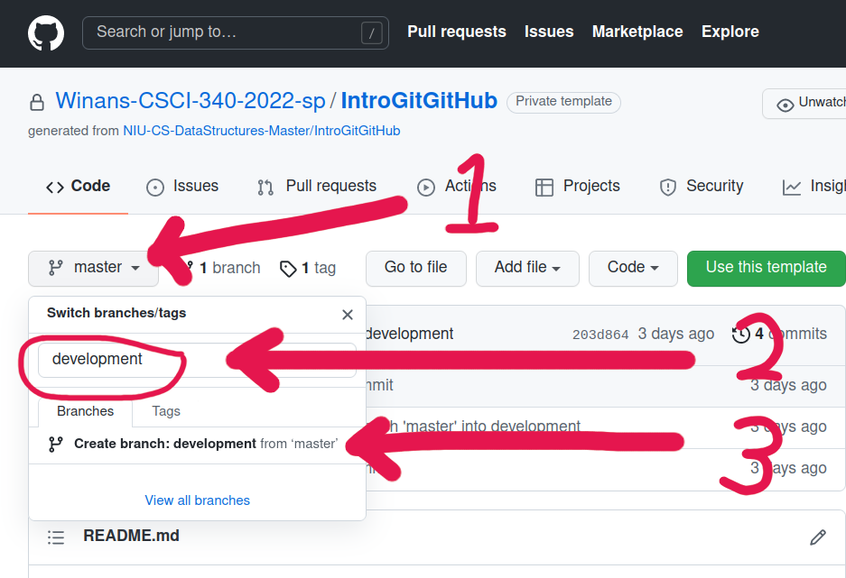

#### CSCI 340 - Data Structures and Algorithm Analysis

**Data Structure:** None <br>
**Programming Focus:** Git and GitHub usage
                  
# Introduction to Git/GitHub

For this computer assignment, you will ***not*** have to write any code.

You will only have to check out the code from the Git repository and make a few changes to `introduction.cc`:

**Programming Notes:**

1) By this point you should have created an account at [GitHub (https://github.com/join)](https://github.com/join) and shared your username with your instructor by what ever method they gathered that information.

*Helpful Git & GitHub Guides:*

* GitHub Guide: [Hello World](https://guides.github.com/activities/hello-world/)
* [2-Pager of Git Commands](https://education.github.com/git-cheat-sheet-education.pdf)
* [List of Git Tutorials](https://help.github.com/articles/good-resources-for-learning-git-and-github/)

2) You will be given a link to an invitation for this assignment generated by GitHub Classroom, copy the link to a browser to accept assignment. It will look something like this:

`https://classroom.github.com/a/<alphanumeric code>`

Once you click on link you will be taken to a page that asks if you want to accept this assignment, ***read*** the message you want to make sure that it says something like the following:

>Accepting this assignment will give you access to the `introduction-YourGitHubUserName` repository in the @NIU-CS-DataStructures organization on GitHub.

The key thing you want to look for is that your ***GitHub login*** is after the dash in specified repository. In general you should be prompted to login via the upper right-hand side sign in button. If you are using a shared computer (i.e. lab computer) the browser may cache someone elses login name.  You can address this by clearing browser cache and making sure you are logged into github in another tab in the same browser. If you still have problems let your ***instructor*** and ***TA*** know ASAP. **DO NOT ACCEPT ASSIGNMENT IF LOGIN NAME IS WRONG!!!!**

After you accept, you will be taken to a page that has something like the following:

>You're ready to go!<br><br>
You accepted the assignment, **introduction**.<br><br>
First, accept your invitation to NIU-CS-DataStructures:<br><br>
`https://github.com/orgs/NIU-CS-DataStructures/invitation`<br><br>
Then, access your assignment:<br><br>
`https://github.com/NIU-CS-DataStructures/introduction-YourGitHubUserName`

3) At this point you are ready to begin working on the assignment by getting a copy of the files onto your development machine.  The process of doing so requires the following steps:
    * On Github, create a development branch using the github web site by 1) clicking on the branch menu (labeled 'main' or 'master'), 2) enter the name of the branch (development), and 3) click on 'Create branch: ...' as seen below:
    
    * On your development machine (such as turing.cs.niu.edu or hopper.cs.niu.edu)
      - Clone the repo from github:<br>
	  `git clone git@github.com:YourGithubID/IntroGitGitHub.git`
      - Change directory into the new project directory:<br>
	  `cd IntroGitGitHub`
      -  checkout the development branch:<br>
	  `git checkout development`

4) You will then complete the assignment by making and committing changes to your development branch as follows:

* Add the following doc-box comment, commit to your local repository, and then push the change to the remote repository. The comment will be modified to reflect your name, ZId, and section number (e.g. CSCI 340-#) This should be at the top of every file you modify this semester, failure to include this comment will result in a lower grade on assignment.

```c++
/* 	Your Name
	Your ZId
	Your Course and Section Number
	
	I certify that this is my own work and where appropriate an extension 
	of the starter code provided for the assignment.
*/
```

* Add the code below as the first line of code within `main` routine of the file `introduction.cc`, commit this change (including the error) to your local repository, and then push the change to the remote repository.

```c++
cut << "Data Structures are Important!!" << endl;   // Yes, I know there is a typo!!!
```

* Create a `Makefile` for this assignment that compiles and builds an executable named *introduction*. The Makefile must produce `introduction` by simply executing the command `make`.

* Add the Makefile to your local repository, commit changes, and push to remote repository.

* Execute the `make` command, correct any compiler errors, commit any required changes, and push the final draft of your files to the remote repository.

When your program is ready for grading and you have completed the last ***commit*** and ***push*** of your local repository to remote repository, follow the _**Assignment Submission Instructions**_ by creating a pull request (using github.)
